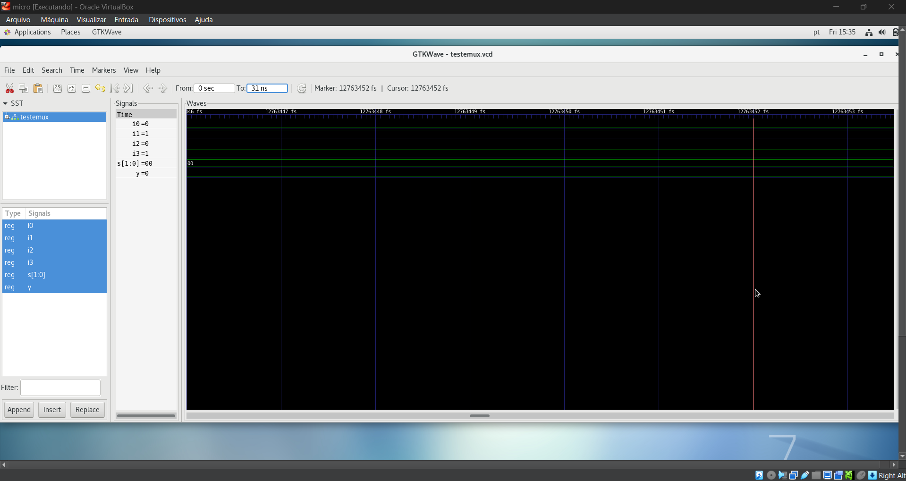
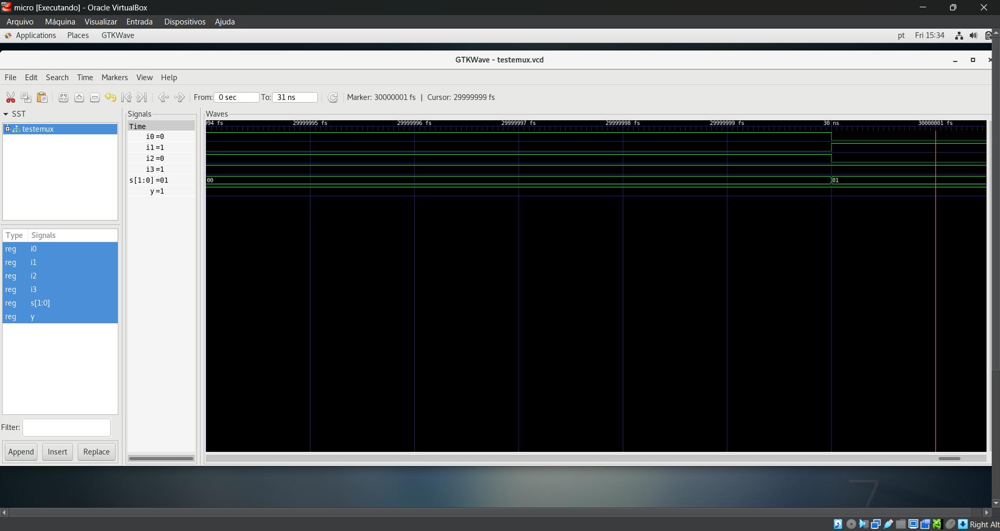

## Description of Files and Folders

- **/multiplexers**: Contains the VHDL files for the multiplexers.
  
- **/testbench**: Contains the file `testemux.vhdl`, which is the testbench used to test the multiplexers. This file simulates the behavior of the multiplexers to ensure they function correctly.

- **/images**: Contains the images generated by GTKWave.

## How to Use

1. **Compile the VHDL files**: Use your preferred VHDL development environment (such as ModelSim or GHDL) to compile the VHDL files in the `/multiplexers` folder.

2. **Run the Testbench**: Execute the `testemux.vhdl` file to simulate the behavior of the multiplexers.

3. **View the Results in GTKWave**: After running the simulation, open the waveform files generated (the `.vcd` or `.ghw` files) in GTKWave to view the waveforms. The images in the `/images` folder represent the graphs generated during the simulation.

4. **Analysis**: Analyze the graphs to check the behavior of the multiplexers in different input scenarios.

5. Here are the waveforms generated in GTKWave during the simulation of the 4x1 multiplexer:

### Waveform

---

These two images represent the waveforms simulated in GTKWave for the `testemux.vhdl` testbench.
